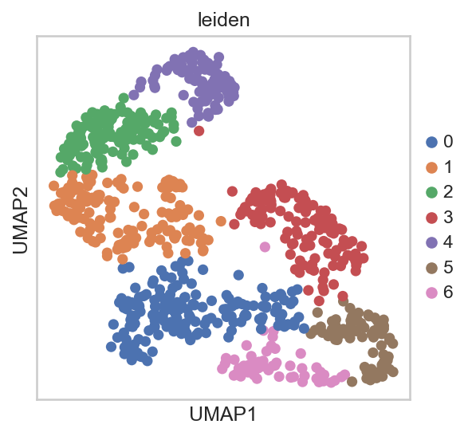

# Retina scRNA-seq Analysis Pipeline (GSE118614)



This repository contains a **Scanpy-based single-cell RNA-seq analysis** of the mouse retinal development dataset **GSE118614** from GEO.
The pipeline explores transcriptional heterogeneity in developing retinal cells and identifies cell populations through clustering and marker gene discovery.

## Dataset

**GSE118614 – Single-cell RNA-Seq Analysis of Retinal Development Identifies NFI Factors as Regulating Mitotic Exit and Late-Born Cell Specification**

Files used:

* `GSE118614_Smart_aggregate.mtx.gz`
* `GSE118614_Smart_cells.tsv.gz`
* `GSE118614_Smart_genes.tsv.gz`

Download from GEO and place them in the working directory before running the notebook.

## Pipeline Overview

Standard **Scanpy single-cell workflow**:

1. Load MTX count matrix and metadata
2. Quality control and filtering
3. Normalization and log transformation
4. Highly variable gene detection
5. PCA dimensionality reduction
6. UMAP visualization
7. Leiden clustering
8. Marker gene identification

## Repository Structure

```
Retina-scRna-Analysis-Pipeline/

notebook/
   retinal_scrna_pipeline.ipynb

figures/
   _.png

README.md
```

## Requirements

```
python >= 3.9
scanpy
anndata
numpy
pandas
scipy
matplotlib
seaborn
jupyter
```

Install dependencies:

```
Basics : 
- conda install numpy scipy pandas matplotlib seaborn scikit-learn -y

Scanty ecosystem
- conda install scanpy anndata umap-learn leidenalg python-igraph -y

```

## Output

The pipeline generates:

* QC plots
* Highly variable gene plot
* PCA variance plot
* UMAP visualization of retinal cell clusters
* Leiden clustering results
* Marker genes per cluster

## Author

Disha Naudiyal
Single-cell RNA-seq analysis | Bioinformatics
